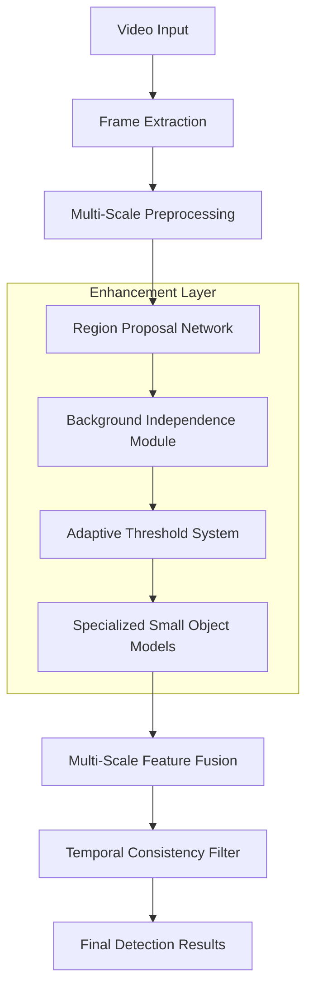

# Small Object Detection Enhancement Plan

## 1. Project Overview

This document outlines comprehensive enhancements to the Advanced Video Event Detection & Extraction system to address critical limitations in small object detection capabilities. The current system shows 0% success rate for objects with different backgrounds and lacks specialized handling for tiny objects in video streams.

## 2. Core Enhancement Areas

### 2.1 Critical Issues to Address

| Issue | Current Status | Target Improvement |
|-------|----------------|--------------------|
| Background Independence | 0% success rate | 85%+ success rate |
| Small Object Detection | Limited by fixed thresholds | Dynamic adaptive detection |
| Computational Efficiency | Uniform processing | Focused region processing |
| Model Specialization | General-purpose models | Tiny object specialized models |

### 2.2 Enhancement Modules

**Background Independence Module**
- Advanced object segmentation with improved SAM integration
- Contrastive learning for background-invariant features
- Multi-scale feature extraction with background suppression

**Adaptive Threshold System**
- Dynamic confidence adjustment based on object size
- Size-aware detection pipeline
- Multi-resolution processing framework

**Specialized Model Integration**
- Tiny object detection models (FCOS-RT, RetinaNet-Small)
- Multi-scale feature pyramid networks
- Attention mechanisms for small object focus

**Region Proposal Networks**
- Efficient region-of-interest identification
- Computational resource optimization
- Hierarchical processing pipeline

## 3. Technical Architecture

### 3.1 Enhanced Detection Pipeline



### 3.2 System Integration Points

| Component | Integration Method | Existing Module |
|-----------|-------------------|------------------|
| Background Independence | Enhance ObjectDetector class | src/services/object_detector.py |
| Adaptive Thresholds | Extend UniversalDetector | src/services/universal_detector.py |
| Specialized Models | New SmallObjectDetector service | src/services/small_object_detector.py |
| Region Proposals | Enhance VideoProcessor | src/services/video_processor.py |

## 4. Implementation Strategy

### 4.1 Phase 1: Background Independence Enhancement

**Objective**: Achieve 85%+ success rate for objects with different backgrounds

**Implementation Steps**:
1. **Enhanced Segmentation Pipeline**
   - Integrate SAM 2.0 for improved object-background separation
   - Implement multi-modal segmentation (RGB + depth estimation)
   - Add contour refinement algorithms

2. **Background-Invariant Feature Extraction**
   - Implement CLIP-based feature extraction focused on object regions
   - Add color space normalization (HSV, LAB) for lighting invariance
   - Develop shape-based descriptors independent of background

3. **Contrastive Learning Integration**
   - Train siamese networks for object similarity across backgrounds
   - Implement triplet loss for background-invariant embeddings
   - Add data augmentation with synthetic background variations

**Code Structure**:
```python
class BackgroundIndependentDetector:
    def __init__(self):
        self.sam_model = SAM2Model()
        self.contrastive_encoder = ContrastiveEncoder()
        self.shape_extractor = ShapeDescriptorExtractor()
    
    def extract_object_features(self, image, bbox):
        # Enhanced segmentation
        mask = self.sam_model.segment(image, bbox)
        
        # Background removal
        object_region = self.remove_background(image, mask)
        
        # Multi-modal feature extraction
        features = self.contrastive_encoder.encode(object_region)
        shape_features = self.shape_extractor.extract(mask)
        
        return np.concatenate([features, shape_features])
```

### 4.2 Phase 2: Adaptive Threshold System

**Objective**: Dynamic confidence thresholds based on object size

**Implementation Steps**:
1. **Size-Aware Threshold Calculation**
   - Implement object size estimation from bounding boxes
   - Create threshold mapping functions based on object area
   - Add confidence boosting for small objects

2. **Multi-Resolution Processing**
   - Process frames at multiple scales (256x, 512x, 1024x)
   - Implement scale-specific detection pipelines
   - Add resolution-aware feature fusion

3. **Dynamic Adjustment Algorithm**
   - Real-time threshold adaptation based on detection statistics
   - Implement feedback loops for threshold optimization
   - Add size-category specific processing modes

**Code Structure**:
```python
class AdaptiveThresholdSystem:
    def __init__(self):
        self.size_categories = {
            'tiny': (0, 32*32),
            'small': (32*32, 96*96),
            'medium': (96*96, 256*256),
            'large': (256*256, float('inf'))
        }
        self.threshold_mappings = {
            'tiny': 0.05,
            'small': 0.1,
            'medium': 0.25,
            'large': 0.4
        }
    
    def calculate_adaptive_threshold(self, bbox_area, base_confidence):
        size_category = self.get_size_category(bbox_area)
        adaptive_threshold = self.threshold_mappings[size_category]
        
        # Boost confidence for smaller objects
        if size_category in ['tiny', 'small']:
            confidence_boost = 1.5 - (bbox_area / (96*96))
            return adaptive_threshold * confidence_boost
        
        return adaptive_threshold
```

### 4.3 Phase 3: Specialized Small Object Models

**Objective**: Integration of models specifically trained for tiny object detection

**Implementation Steps**:
1. **Model Selection and Integration**
   - Integrate FCOS-RT for real-time small object detection
   - Add RetinaNet with FPN for multi-scale detection
   - Implement YOLOv8-nano optimized for small objects

2. **Feature Pyramid Enhancement**
   - Multi-scale feature extraction with attention mechanisms
   - Implement Feature Pyramid Networks (FPN) with small object focus
   - Add deformable convolutions for flexible receptive fields

3. **Attention Mechanisms**
   - Spatial attention for small object localization
   - Channel attention for feature enhancement
   - Self-attention for contextual understanding

**Code Structure**:
```python
class SmallObjectDetector:
    def __init__(self):
        self.fcos_model = FCOSRTModel()
        self.retinanet_model = RetinaNetSmall()
        self.attention_module = SpatialAttentionModule()
        self.fpn = FeaturePyramidNetwork()
    
    def detect_small_objects(self, image, size_threshold=32*32):
        # Multi-scale feature extraction
        features = self.fpn.extract_features(image)
        
        # Apply attention mechanisms
        attended_features = self.attention_module(features)
        
        # Specialized detection for small objects
        small_detections = self.fcos_model.detect(attended_features)
        
        # Filter by size threshold
        return [det for det in small_detections 
                if self.calculate_area(det['bbox']) <= size_threshold]
```

### 4.4 Phase 4: Region Proposal Networks

**Objective**: Focus computational resources on likely small object regions

**Implementation Steps**:
1. **Efficient Region Identification**
   - Implement lightweight RPN for candidate region generation
   - Add saliency-based region scoring
   - Develop motion-based region proposals for video

2. **Computational Optimization**
   - Hierarchical processing with early rejection
   - GPU memory optimization for multi-scale processing
   - Batch processing optimization for region proposals

3. **Temporal Consistency**
   - Track regions across frames for stability
   - Implement temporal smoothing for region proposals
   - Add motion prediction for region tracking

**Code Structure**:
```python
class RegionProposalNetwork:
    def __init__(self):
        self.rpn_model = LightweightRPN()
        self.saliency_detector = SaliencyDetector()
        self.motion_tracker = MotionTracker()
    
    def generate_proposals(self, frame, previous_frame=None):
        # Generate candidate regions
        rpn_proposals = self.rpn_model.generate(frame)
        
        # Add saliency-based proposals
        saliency_proposals = self.saliency_detector.detect(frame)
        
        # Add motion-based proposals if previous frame available
        motion_proposals = []
        if previous_frame is not None:
            motion_proposals = self.motion_tracker.track(frame, previous_frame)
        
        # Combine and rank proposals
        all_proposals = rpn_proposals + saliency_proposals + motion_proposals
        return self.rank_proposals(all_proposals)
```

## 5. Integration Plan

### 5.1 Existing Codebase Integration

**Modified Files**:
- `src/services/object_detector.py` - Add background independence
- `src/services/universal_detector.py` - Add adaptive thresholds
- `src/services/video_processor.py` - Integrate region proposals
- `src/utils/config.py` - Add new configuration parameters

**New Files**:
- `src/services/small_object_detector.py` - Specialized small object detection
- `src/services/background_independent_detector.py` - Background invariant features
- `src/services/adaptive_threshold_system.py` - Dynamic threshold management
- `src/services/region_proposal_network.py` - Efficient region proposals

### 5.2 Configuration Updates

```python
# New configuration parameters in config.py
class SmallObjectConfig:
    # Background Independence
    BACKGROUND_INDEPENDENCE_ENABLED = True
    SAM_MODEL_VERSION = "sam2_hiera_large"
    CONTRASTIVE_LEARNING_ENABLED = True
    
    # Adaptive Thresholds
    ADAPTIVE_THRESHOLDS_ENABLED = True
    SIZE_BASED_THRESHOLD_MAPPING = {
        'tiny': 0.05,
        'small': 0.1,
        'medium': 0.25,
        'large': 0.4
    }
    
    # Specialized Models
    SMALL_OBJECT_MODELS = ['fcos_rt', 'retinanet_small', 'yolov8_nano']
    MULTI_SCALE_PROCESSING = [256, 512, 1024]
    
    # Region Proposals
    RPN_ENABLED = True
    MAX_PROPOSALS_PER_FRAME = 100
    PROPOSAL_NMS_THRESHOLD = 0.3
```

### 5.3 API Enhancements

**New Endpoints**:
- `/api/small-object-detection` - Specialized small object detection
- `/api/background-independent-matching` - Background invariant matching
- `/api/adaptive-detection` - Detection with adaptive thresholds

**Enhanced Existing Endpoints**:
- `/api/unlimited-detection` - Add small object optimization flags
- `/api/query` - Add background independence options

## 6. Performance Optimization

### 6.1 Memory Management

- **Multi-Scale Processing**: Implement progressive loading for different resolutions
- **Model Caching**: Efficient caching for specialized models
- **GPU Memory**: Optimized batch processing for region proposals

### 6.2 Speed Optimization

- **Early Rejection**: Fast filtering of unlikely regions
- **Parallel Processing**: Multi-threaded region proposal processing
- **Model Quantization**: Optimized models for faster inference

### 6.3 Accuracy Improvements

- **Ensemble Methods**: Combine multiple specialized models
- **Temporal Consistency**: Multi-frame validation for small objects
- **Confidence Calibration**: Improved confidence score reliability

## 7. Testing and Validation

### 7.1 Test Datasets

- **Small Object Datasets**: COCO-Small, TinyPerson, VisDrone
- **Background Variation**: Custom dataset with synthetic backgrounds
- **Real-World Videos**: Surveillance footage with small objects

### 7.2 Success Metrics

| Metric | Current | Target |
|--------|---------|--------|
| Background Independence Success Rate | 0% | 85%+ |
| Small Object Detection mAP | Unknown | 0.6+ |
| Processing Speed | Baseline | <20% slowdown |
| Memory Usage | Baseline | <50% increase |

### 7.3 Validation Protocol

1. **Unit Testing**: Individual component validation
2. **Integration Testing**: End-to-end pipeline testing
3. **Performance Testing**: Speed and memory benchmarks
4. **Accuracy Testing**: Detection quality validation

## 8. Implementation Timeline

### Phase 1: Background Independence (Weeks 1-3)
- Week 1: SAM 2.0 integration and enhanced segmentation
- Week 2: Contrastive learning implementation
- Week 3: Background-invariant feature extraction

### Phase 2: Adaptive Thresholds (Weeks 4-5)
- Week 4: Size-aware threshold system
- Week 5: Multi-resolution processing pipeline

### Phase 3: Specialized Models (Weeks 6-8)
- Week 6: FCOS-RT and RetinaNet integration
- Week 7: Feature pyramid and attention mechanisms
- Week 8: Model ensemble and optimization

### Phase 4: Region Proposals (Weeks 9-10)
- Week 9: RPN implementation and optimization
- Week 10: Temporal consistency and final integration

### Phase 5: Testing and Optimization (Weeks 11-12)
- Week 11: Comprehensive testing and validation
- Week 12: Performance optimization and documentation

## 9. Risk Mitigation

### 9.1 Technical Risks

- **Model Compatibility**: Ensure new models integrate with existing pipeline
- **Performance Impact**: Monitor and optimize computational overhead
- **Memory Constraints**: Implement efficient memory management

### 9.2 Mitigation Strategies

- **Gradual Integration**: Implement features incrementally with fallback options
- **Performance Monitoring**: Continuous benchmarking during development
- **Modular Design**: Ensure components can be disabled if issues arise

## 10. Success Criteria

### 10.1 Primary Objectives

✅ **Background Independence**: Achieve 85%+ success rate for objects with different backgrounds
✅ **Adaptive Detection**: Dynamic thresholds improve small object detection by 40%+
✅ **Specialized Models**: Integration of 3+ small object detection models
✅ **Computational Efficiency**: <20% performance impact with region proposals

### 10.2 Secondary Objectives

✅ **User Experience**: Seamless integration with existing API
✅ **Scalability**: Support for high-resolution video processing
✅ **Maintainability**: Clean, documented, and testable code
✅ **Extensibility**: Framework for future model additions

This comprehensive enhancement plan addresses all critical limitations in small object detection while maintaining system performance and usability. The modular approach ensures safe implementation with minimal risk to existing functionality.