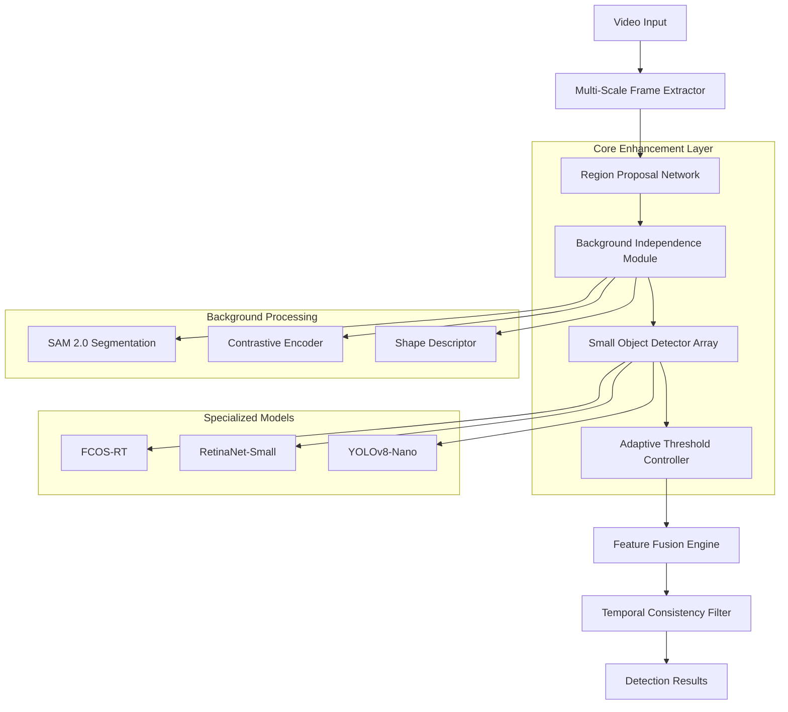
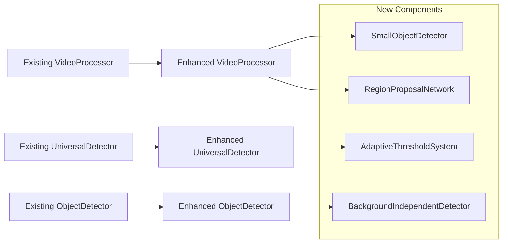

# Small Object Detection Technical Architecture

## 1. Architecture Overview

This document provides the detailed technical architecture for implementing enhanced small object detection capabilities in the Advanced Video Event Detection & Extraction system.

## 2. System Architecture Design

### 2.1 Enhanced Detection Pipeline Architecture



### 2.2 Component Integration Architecture



## 3. Technology Stack

### 3.1 Core Technologies
- **Frontend**: React@18 + TypeScript + Tailwind CSS
- **Backend**: FastAPI + Python 3.8+
- **Database**: Supabase (PostgreSQL)
- **AI/ML**: PyTorch + Transformers + OpenCV
- **Deployment**: Docker + Vercel

### 3.2 Enhanced AI Models
- **Segmentation**: SAM 2.0 (Segment Anything Model)
- **Small Object Detection**: FCOS-RT, RetinaNet-Small, YOLOv8-Nano
- **Feature Extraction**: CLIP, ConvNeXt, EfficientNet
- **Background Removal**: U²-Net, DeepLabV3+

## 4. API Architecture

### 4.1 Enhanced API Endpoints

| Endpoint | Method | Purpose | Enhancement |
|----------|--------|---------|-------------|
| `/api/small-object-detection` | POST | Specialized small object detection | New |
| `/api/background-independent-match` | POST | Background invariant matching | New |
| `/api/adaptive-detection` | POST | Size-aware detection | New |
| `/api/unlimited-detection` | POST | Enhanced with small object support | Enhanced |
| `/api/query` | POST | Enhanced with background independence | Enhanced |

### 4.2 API Request/Response Schemas

#### Small Object Detection Request
```typescript
interface SmallObjectDetectionRequest {
  video_id: string;
  queries: string[];
  detection_mode: 'fcos_rt' | 'retinanet_small' | 'yolov8_nano' | 'ensemble';
  size_threshold: number; // pixels²
  background_independence: boolean;
  adaptive_thresholds: boolean;
  region_proposals: boolean;
}
```

#### Enhanced Detection Response
```typescript
interface EnhancedDetectionResponse {
  task_id: string;
  status: 'processing' | 'completed' | 'failed';
  results: {
    detections: Detection[];
    background_independence_score: number;
    adaptive_threshold_applied: boolean;
    processing_stats: ProcessingStats;
  };
}

interface Detection {
  bbox: [number, number, number, number];
  confidence: number;
  adaptive_confidence: number;
  class_name: string;
  size_category: 'tiny' | 'small' | 'medium' | 'large';
  background_independent: boolean;
  timestamp: number;
  frame_index: number;
}
```

## 5. Database Schema

### 5.1 Enhanced Detection Tables

```sql
-- Enhanced detection results table
CREATE TABLE enhanced_detections (
    id UUID PRIMARY KEY DEFAULT gen_random_uuid(),
    video_id VARCHAR(255) NOT NULL,
    query_text TEXT NOT NULL,
    detection_mode VARCHAR(50) NOT NULL,
    bbox JSONB NOT NULL, -- [x1, y1, x2, y2]
    confidence FLOAT NOT NULL,
    adaptive_confidence FLOAT,
    size_category VARCHAR(20) NOT NULL,
    background_independent BOOLEAN DEFAULT FALSE,
    timestamp_seconds FLOAT NOT NULL,
    frame_index INTEGER NOT NULL,
    processing_stats JSONB,
    created_at TIMESTAMP WITH TIME ZONE DEFAULT NOW()
);

-- Small object detection models table
CREATE TABLE small_object_models (
    id UUID PRIMARY KEY DEFAULT gen_random_uuid(),
    model_name VARCHAR(100) NOT NULL UNIQUE,
    model_type VARCHAR(50) NOT NULL, -- 'fcos_rt', 'retinanet_small', etc.
    model_path TEXT NOT NULL,
    size_specialization JSONB, -- size ranges this model handles best
    performance_metrics JSONB,
    is_active BOOLEAN DEFAULT TRUE,
    created_at TIMESTAMP WITH TIME ZONE DEFAULT NOW()
);

-- Background independence test results
CREATE TABLE background_independence_tests (
    id UUID PRIMARY KEY DEFAULT gen_random_uuid(),
    test_name VARCHAR(255) NOT NULL,
    reference_image_path TEXT NOT NULL,
    target_video_path TEXT NOT NULL,
    success_rate FLOAT NOT NULL,
    total_matches INTEGER NOT NULL,
    background_variations JSONB,
    test_date TIMESTAMP WITH TIME ZONE DEFAULT NOW()
);

-- Adaptive threshold configurations
CREATE TABLE adaptive_threshold_configs (
    id UUID PRIMARY KEY DEFAULT gen_random_uuid(),
    size_category VARCHAR(20) NOT NULL,
    min_area INTEGER NOT NULL,
    max_area INTEGER,
    base_threshold FLOAT NOT NULL,
    confidence_boost FLOAT DEFAULT 1.0,
    is_active BOOLEAN DEFAULT TRUE,
    created_at TIMESTAMP WITH TIME ZONE DEFAULT NOW()
);

-- Create indexes for performance
CREATE INDEX idx_enhanced_detections_video_id ON enhanced_detections(video_id);
CREATE INDEX idx_enhanced_detections_size_category ON enhanced_detections(size_category);
CREATE INDEX idx_enhanced_detections_timestamp ON enhanced_detections(timestamp_seconds);
CREATE INDEX idx_small_object_models_type ON small_object_models(model_type);
CREATE INDEX idx_adaptive_threshold_configs_category ON adaptive_threshold_configs(size_category);

-- Grant permissions
GRANT SELECT ON enhanced_detections TO anon;
GRANT ALL PRIVILEGES ON enhanced_detections TO authenticated;
GRANT SELECT ON small_object_models TO anon;
GRANT ALL PRIVILEGES ON small_object_models TO authenticated;
GRANT SELECT ON background_independence_tests TO anon;
GRANT ALL PRIVILEGES ON background_independence_tests TO authenticated;
GRANT SELECT ON adaptive_threshold_configs TO anon;
GRANT ALL PRIVILEGES ON adaptive_threshold_configs TO authenticated;
```

## 6. Implementation Architecture

### 6.1 Core Service Classes

#### SmallObjectDetector Service
```python
class SmallObjectDetector:
    """
    Specialized detector for small objects using multiple models
    """
    
    def __init__(self, config: SmallObjectConfig):
        self.models = {
            'fcos_rt': FCOSRTModel(),
            'retinanet_small': RetinaNetSmall(),
            'yolov8_nano': YOLOv8Nano()
        }
        self.feature_pyramid = FeaturePyramidNetwork()
        self.attention_module = SpatialAttentionModule()
        self.config = config
    
    async def detect_small_objects(
        self, 
        image: np.ndarray,
        queries: List[str],
        size_threshold: int = 1024,  # pixels²
        detection_mode: str = 'ensemble'
    ) -> List[Detection]:
        """
        Detect small objects using specialized models
        """
        # Multi-scale feature extraction
        features = await self.feature_pyramid.extract_features(image)
        
        # Apply attention for small object focus
        attended_features = self.attention_module(features)
        
        # Run detection with specified model(s)
        if detection_mode == 'ensemble':
            detections = await self._ensemble_detection(attended_features, queries)
        else:
            model = self.models[detection_mode]
            detections = await model.detect(attended_features, queries)
        
        # Filter by size threshold
        small_detections = [
            det for det in detections 
            if self._calculate_area(det.bbox) <= size_threshold
        ]
        
        return small_detections
```

#### BackgroundIndependentDetector Service
```python
class BackgroundIndependentDetector:
    """
    Detector that focuses on object features independent of background
    """
    
    def __init__(self):
        self.sam_model = SAM2Model()
        self.contrastive_encoder = ContrastiveEncoder()
        self.shape_extractor = ShapeDescriptorExtractor()
        self.background_remover = BackgroundRemover()
    
    async def extract_background_independent_features(
        self, 
        image: np.ndarray, 
        bbox: Tuple[int, int, int, int]
    ) -> np.ndarray:
        """
        Extract features that are invariant to background changes
        """
        # Segment object using SAM 2.0
        mask = await self.sam_model.segment(image, bbox)
        
        # Remove background
        object_region = self.background_remover.remove(image, mask)
        
        # Extract contrastive features
        contrastive_features = self.contrastive_encoder.encode(object_region)
        
        # Extract shape-based features
        shape_features = self.shape_extractor.extract(mask)
        
        # Combine features
        combined_features = np.concatenate([
            contrastive_features, 
            shape_features
        ])
        
        return combined_features
```

#### AdaptiveThresholdSystem Service
```python
class AdaptiveThresholdSystem:
    """
    Dynamic threshold adjustment based on object size and context
    """
    
    def __init__(self, config: AdaptiveThresholdConfig):
        self.size_categories = config.SIZE_CATEGORIES
        self.threshold_mappings = config.THRESHOLD_MAPPINGS
        self.confidence_boosters = config.CONFIDENCE_BOOSTERS
    
    def calculate_adaptive_threshold(
        self, 
        bbox_area: int, 
        base_confidence: float,
        context: Optional[Dict] = None
    ) -> float:
        """
        Calculate adaptive threshold based on object size and context
        """
        # Determine size category
        size_category = self._get_size_category(bbox_area)
        
        # Get base threshold for size category
        base_threshold = self.threshold_mappings[size_category]
        
        # Apply confidence boosting for small objects
        if size_category in ['tiny', 'small']:
            boost_factor = self.confidence_boosters[size_category]
            # Inverse relationship: smaller objects get higher boost
            size_boost = boost_factor * (1.0 - (bbox_area / self.size_categories['small'][1]))
            adjusted_threshold = base_threshold * (1.0 + size_boost)
        else:
            adjusted_threshold = base_threshold
        
        # Context-based adjustments
        if context:
            if context.get('motion_detected', False):
                adjusted_threshold *= 0.9  # Lower threshold for moving objects
            if context.get('high_noise', False):
                adjusted_threshold *= 1.1  # Higher threshold in noisy conditions
        
        return min(adjusted_threshold, 0.9)  # Cap at 0.9
```

#### RegionProposalNetwork Service
```python
class RegionProposalNetwork:
    """
    Efficient region proposal generation for focused processing
    """
    
    def __init__(self):
        self.rpn_model = LightweightRPN()
        self.saliency_detector = SaliencyDetector()
        self.motion_tracker = OpticalFlowTracker()
        self.proposal_ranker = ProposalRanker()
    
    async def generate_proposals(
        self, 
        current_frame: np.ndarray,
        previous_frame: Optional[np.ndarray] = None,
        max_proposals: int = 100
    ) -> List[RegionProposal]:
        """
        Generate ranked region proposals for efficient processing
        """
        proposals = []
        
        # RPN-based proposals
        rpn_proposals = await self.rpn_model.generate(current_frame)
        proposals.extend(rpn_proposals)
        
        # Saliency-based proposals
        saliency_proposals = self.saliency_detector.detect_salient_regions(
            current_frame
        )
        proposals.extend(saliency_proposals)
        
        # Motion-based proposals (if previous frame available)
        if previous_frame is not None:
            motion_proposals = self.motion_tracker.track_motion_regions(
                previous_frame, current_frame
            )
            proposals.extend(motion_proposals)
        
        # Rank and filter proposals
        ranked_proposals = self.proposal_ranker.rank(proposals)
        
        return ranked_proposals[:max_proposals]
```

### 6.2 Enhanced Configuration Architecture

```python
# Enhanced configuration for small object detection
class SmallObjectDetectionConfig:
    # Model configurations
    MODELS = {
        'fcos_rt': {
            'model_path': 'models/fcos_rt_small.pth',
            'input_size': (512, 512),
            'confidence_threshold': 0.05,
            'nms_threshold': 0.3,
            'specialization': 'tiny_objects'
        },
        'retinanet_small': {
            'model_path': 'models/retinanet_small.pth',
            'input_size': (640, 640),
            'confidence_threshold': 0.1,
            'nms_threshold': 0.4,
            'specialization': 'small_objects'
        },
        'yolov8_nano': {
            'model_path': 'models/yolov8n_small.pt',
            'input_size': (416, 416),
            'confidence_threshold': 0.15,
            'nms_threshold': 0.45,
            'specialization': 'fast_small_objects'
        }
    }
    
    # Size category definitions (in pixels²)
    SIZE_CATEGORIES = {
        'tiny': (0, 32*32),
        'small': (32*32, 96*96),
        'medium': (96*96, 256*256),
        'large': (256*256, float('inf'))
    }
    
    # Adaptive threshold mappings
    THRESHOLD_MAPPINGS = {
        'tiny': 0.05,
        'small': 0.1,
        'medium': 0.25,
        'large': 0.4
    }
    
    # Confidence boosting factors
    CONFIDENCE_BOOSTERS = {
        'tiny': 2.0,
        'small': 1.5,
        'medium': 1.0,
        'large': 1.0
    }
    
    # Background independence settings
    BACKGROUND_INDEPENDENCE = {
        'enabled': True,
        'sam_model': 'sam2_hiera_large',
        'contrastive_learning': True,
        'shape_descriptors': True,
        'color_normalization': ['hsv', 'lab']
    }
    
    # Region proposal settings
    REGION_PROPOSALS = {
        'enabled': True,
        'max_proposals_per_frame': 100,
        'nms_threshold': 0.3,
        'saliency_weight': 0.3,
        'motion_weight': 0.4,
        'rpn_weight': 0.3
    }
```

## 7. Performance Optimization Architecture

### 7.1 Memory Management

```python
class SmallObjectMemoryManager:
    """
    Optimized memory management for small object detection
    """
    
    def __init__(self):
        self.model_cache = LRUCache(maxsize=3)  # Cache up to 3 models
        self.feature_cache = LRUCache(maxsize=50)  # Cache features
        self.gpu_memory_monitor = GPUMemoryMonitor()
    
    async def load_model_efficiently(self, model_name: str):
        """
        Load models with memory optimization
        """
        if model_name in self.model_cache:
            return self.model_cache[model_name]
        
        # Check GPU memory before loading
        if self.gpu_memory_monitor.get_available_memory() < 2.0:  # 2GB threshold
            await self._cleanup_gpu_memory()
        
        # Load model with quantization if needed
        model = await self._load_with_quantization(model_name)
        self.model_cache[model_name] = model
        
        return model
```

### 7.2 Parallel Processing Architecture

```python
class ParallelSmallObjectProcessor:
    """
    Parallel processing for multiple detection models
    """
    
    def __init__(self, max_workers: int = 3):
        self.executor = ThreadPoolExecutor(max_workers=max_workers)
        self.gpu_queue = asyncio.Queue(maxsize=2)  # Limit GPU concurrent access
    
    async def process_parallel_detection(
        self, 
        image: np.ndarray,
        queries: List[str],
        models: List[str]
    ) -> List[Detection]:
        """
        Run multiple detection models in parallel
        """
        tasks = []
        
        for model_name in models:
            task = asyncio.create_task(
                self._run_single_model_detection(image, queries, model_name)
            )
            tasks.append(task)
        
        # Wait for all models to complete
        results = await asyncio.gather(*tasks)
        
        # Merge and deduplicate results
        merged_detections = self._merge_detections(results)
        
        return merged_detections
```

## 8. Testing Architecture

### 8.1 Automated Testing Pipeline

```python
class SmallObjectTestSuite:
    """
    Comprehensive testing suite for small object detection
    """
    
    def __init__(self):
        self.test_datasets = {
            'coco_small': COCOSmallDataset(),
            'tiny_person': TinyPersonDataset(),
            'visdrone': VisDroneDataset()
        }
        self.background_test_generator = BackgroundTestGenerator()
    
    async def run_background_independence_tests(self) -> TestResults:
        """
        Test background independence across various scenarios
        """
        test_cases = [
            ('no_background', 'various_backgrounds'),
            ('indoor_background', 'outdoor_background'),
            ('day_lighting', 'night_lighting'),
            ('simple_background', 'complex_background')
        ]
        
        results = []
        for source_bg, target_bg in test_cases:
            success_rate = await self._test_background_scenario(
                source_bg, target_bg
            )
            results.append({
                'scenario': f"{source_bg} -> {target_bg}",
                'success_rate': success_rate,
                'target': 0.85  # 85% target success rate
            })
        
        return TestResults(results)
```

## 9. Monitoring and Analytics

### 9.1 Performance Monitoring

```python
class SmallObjectPerformanceMonitor:
    """
    Monitor performance metrics for small object detection
    """
    
    def __init__(self):
        self.metrics_collector = MetricsCollector()
        self.alert_system = AlertSystem()
    
    async def track_detection_performance(
        self, 
        detection_results: List[Detection],
        processing_time: float,
        memory_usage: float
    ):
        """
        Track and analyze detection performance
        """
        metrics = {
            'total_detections': len(detection_results),
            'small_object_ratio': self._calculate_small_object_ratio(detection_results),
            'average_confidence': np.mean([d.confidence for d in detection_results]),
            'processing_time': processing_time,
            'memory_usage': memory_usage,
            'background_independent_ratio': self._calculate_bg_independent_ratio(detection_results)
        }
        
        await self.metrics_collector.record(metrics)
        
        # Check for performance alerts
        if metrics['processing_time'] > 10.0:  # 10 second threshold
            await self.alert_system.send_alert(
                'High processing time detected',
                metrics
            )
```

This technical architecture provides a comprehensive foundation for implementing enhanced small object detection capabilities while maintaining system performance and reliability. The modular design ensures easy integration with the existing codebase and allows for future enhancements.